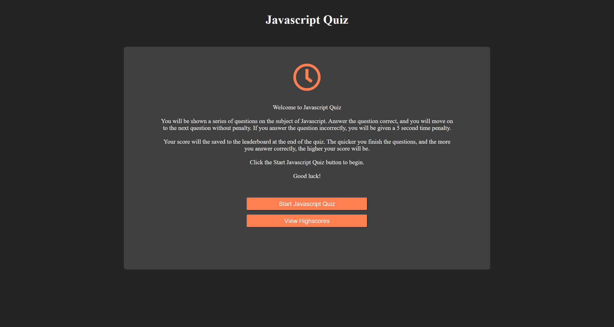

# Javascript Quiz

## Description

This is a multiple choice quiz based on questions about Javascrip development. Users have four choices per question to choose from, and 30 seconds to answer them all. Users can save their intials and highscore to the leaderboard to see where they compare to their peers.

## Usage

To start the quiz, click the "Start Javascript Quiz" button. You will begin a series of questions with four possible answers. If you choose the correct answer, you will move onto the next question without a time penalty. If you choose the wrong answer, you will be given a 5 second time penalty. If the timer reaches zero before you have answered all the questions, then the game will be over. Once complete you will be asked to enter your intials to save your score on the leaderboard. You can click the "Start Javascript Quiz" button on the leaderboard screen to retake the quiz if you choose. You may also view the highscore leaderboards before beginning by clicking the "View Highscores" button.[https://dbernard87.github.io/javascript-quiz/]

## Features

- Four choices per question.
- 30 second timer to determine user score.
- Highscore leaderboard.
- Javascript, CSS, and HTML.

## Credits

- David Bernard : [https://github.com/dbernard87]
- Icons from Font Awesome : [https://fontawesome.com/]
- Stack Overflow : [https://stackoverflow.com/]
- w3schools : [https://www.w3schools.com/]
- UNH Bootcamp Web API Activity #26 : [https://bootcamp.unh.edu/]